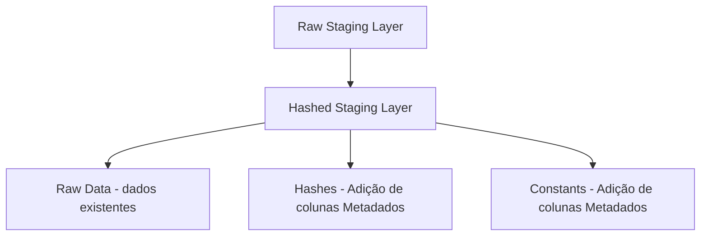

# Aprendendo Data Vault

...
...

___

## dbtvault (lib)

Para começar a utilizar a lib, a primeira coisa a se fazer é obter uma base de dados compativel com a biblioteca. Aqui usarei ``Snowflake``, pois é o ``SQL Flavor`` que mais tem aderencia ao funcionamento geral da biblioteca.

Apos configurar uma conta trial do Snowflake, vamos isolar nosso ambiente utilizando virtualenv. Para instalar o dbt neste ambiente isolado, seguiremos os passos abaixo:

``` shell
virtualenv .venv

pip install dbt-snowflake

pip freeze >> requirements.txt
```

Para utilizar o ambiente isolado posteriormente é só utilizar o comando abaixo:

``` shell
pip install -r requirements.txt
```

Vamos iniciar nosso projeto dbtvault. Primeiro, execute o comando:

``` shell
dbt init <nomedoprojeto>
```
> Aqui forneça as informações que foram pedidas para configurar a conexão do ambiente.

Agora entre na pasta do projeto dbt e rode o seguinte comando, para verificar se sua conexão está ok.

``` shell
cd <pasta_projeto_dbt>
dbt debug
```

Obtendo o retorno positivo, crie o arquivo `packages.yml` na raiz do projeto dbt e deixe ele assim:

``` yml
packages:
  - package: Datavault-UK/dbtvault
    version: 0.9.0
```

Agora rode o seguinte comando, para instalar a lib dbtvault:

``` shell
dbt deps
```

Note que agora seu projeto possui uma pasta chamada `dbt_packages` e dentro dela está a lib.

Agora que temos tudo instalado, temos que configurar algumas coisas no nosso projeto.

### Configurando **``dbt_project.yml``**

Adicionando variaveis ao arquivo:

``` yml
vars:
  load_date: '1992-01-08'
  tpch_size: 10 #1, 10, 100, 1000, 10000
```

### Configurando **``sources.yml``**

``` yml
version: 2

sources:
  - name: tpch_sample
    database: SNOWFLAKE_SAMPLE_DATA
    schema: TPCH_SF{{ var('tpch_size', 10) }}
    tables:
      - name: LINEITEM
      - name: CUSTOMER
      - name: ORDERS
      - name: PARTSUPP
      - name: SUPPLIER
      - name: PART
      - name: NATION
      - name: REGION
```

### Arquitetura da camada stage



- **Raw Staging Layer** - A camada raw da stage geralmente é apenas uma view que pega os dados brutos da origem da forma que ele vem.

- **Hashed Staging Layer** - Pega os dados da ``Raw stage`` e adiciona metadados referentes ao **Data Vault**, como o ``load date`` e o ``record source``, como novas colunas.

A configuração basica da ``stage`` pode ser feita separando por pastas:

``` shell
models
  |
  -- raw_stage
  |  |
  |  -- raw_orders.sql # view, dados brutos AS-IS
  |
  -- stage
      |
      -- v_stg_orders.sql

```
Para iniciarmos a construção da `Hashed Staging Layer`, vamos começar criando o arquivo citado acima `v_stg_orders.sql`, e vamos adicionar algumas variáveis:

``` sql
{{ 
    config(
    materialized='view'
    )
}}


source_model: raw_orders






{{ dbtvault.stage(
                include_source_columns=true,
                source_model=source_model,
                derived_columns=derived_columns,
                hashed_columns=hashed_columns)
                }}

```

> Aqui nesse exemplo estamos criando uma variavel em formato de yml, apenas com 1 chave-valor, que apenas referenciar a tabela da `Raw Stage`. Depois usamos uma função para transformar o yml em dicionário e passamos o valor para a variavel reservada do **``dbtvault``** (source_model). E no final estamos utilizando a macro stage do **``dbtvault``**. Note que no exemplo acima ainda não criamos as variaveis: ``derived_columns`` e ``hashed_columns``.

Até aqui, da forma que construimos ao rodar o script, o arquivo `v_stg_orders.sql` vai gerar uma view igual à `raw_orders.sql`.

**É importante notar isso, pois a partir daqui começamos a adicionar caracteristicas do Data Vault em nosso modelo.**

Para que nossa `Prime Stage` seja construida da melhor forma iremos adicionar o parametro `derived_columns` no modelo:

``` sql
...

source_model: raw_orders
derived_columns:
    RECORD_SOURCE: "!TPCH-ORDERS"
    LOAD_DATE: DATEADD(DAY, 30, ORDERDATE)
    EFFECTIVE_FROM: ORDERDATE

...
```
> - Note que o valor referente ao ``record_source`` possui um "!" no inicio. Esta é uma funcionalidade do dbtvault que diz ao modelo que o valor declarado é uma constante a ser atribuida para todas as linhas do modelo.
> - Como para este dataset não temos um campo de quando o dado foi carregado, estamos simulando que o `load_date` corresponde à 30 dias após a realização do pedido.
> - O parametro `EFFECTIVE_FROM` é utilizado para gerar a data de inicio (``src_start_date``) de um registro de `Effectivity Satellites`.

Após adicionar as colunas derivadas ao yml, não se esqueça de extrair esta informação para a que a variavel `derived_columns` da macro stage extraia as informações para adicionar ao modelo.

``` sql

```

Seguindo estes passos, o nosso modelo irá gerar as colunas derivadas em nossa `Prime Stage`.